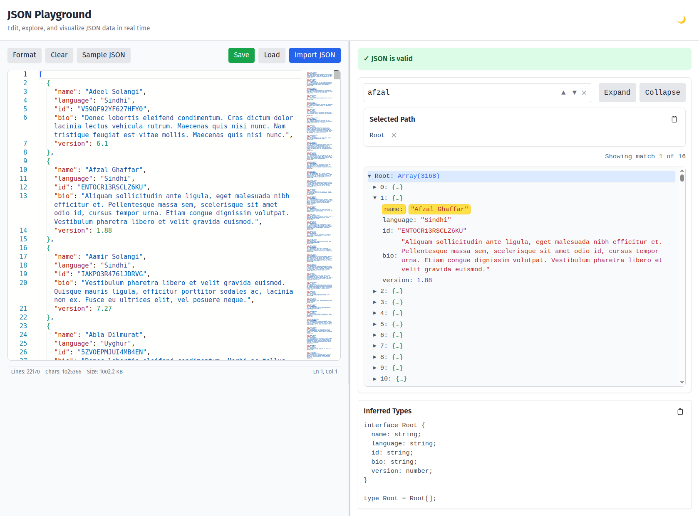

# JSON → TypeScript Type Explorer

A small web tool for exploring JSON data and instantly generating TypeScript types from it.  
Paste JSON (or drag/import file) on the left, and see a structured, collapsible tree on the right, along with the inferred TypeScript type. Search runs inside a Web Worker to keep the UI smooth and responsive, even when handling large JSON inputs.

## Features

- **Live JSON parsing** with clear error feedback.
- **Collapsible tree view** to inspect nested objects and arrays.
- Automatically **generates TypeScript types** from the JSON structure.
- **Copy TS button** for quick workflow.
- **Search support** using your browser's `Ctrl+F`.

## Tech Stack

- React + Vite
- TypeScript

## Running Locally

```bash
npm install
npm run dev
```

## Preview


